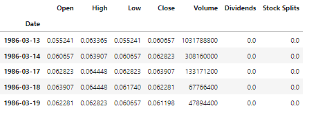

# The yfinance Python library

The `yfinance` is a Python library with a user-friendly interface for downloading historical market data from Yahoo Finance. It lets you get historical stock prices, dividends, and other financial data for stocks, exchange-traded funds (ETFs), and other securities.

This example shows code for using `yfinance` to download historical stock prices.

```python
import yfinance as yf

# Download historical data for a stock
msft = yf.Ticker("MSFT")
msft_data = msft.history(period="max")

# Display the downloaded data
msft_data.head()
```

**Explanation for the above code:**

- First, import the `yfinance` library using the alias `yf`.
- Then, create a `Ticker` object for the Microsoft stock (“MSFT”).
- Use the `history` method of the Ticker object to download the historical data for the stock. The `period` parameter of the `history` method specifies when you want to download the data. In this example, it is set to `max` to download the maximum available historical data.

Here are some of the possible values for the period parameter and what they represent:

- period="1d": Download 1 day of historical data.
- period="5d": Download 5 days of historical data.
- period="1mo": Download 1 month of historical data.
- period="3mo": Download 3 months of historical data.
- period="6mo": Download 6 months of historical data.
- period="1y": Download 1 year of historical data.
- period="2y": Download 2 years of historical data.
- period="5y": Download 5 years of historical data.
- period="10y": Download 10 years of historical data.
- period="ytd": Download historical data since the beginning of the current year.
- period="max": Download all available historical data.

Finally, you print the downloaded data using the `head` function. This downloaded data will display a Pandas data frame containing Microsoft's historical stock prices and other financial data.

