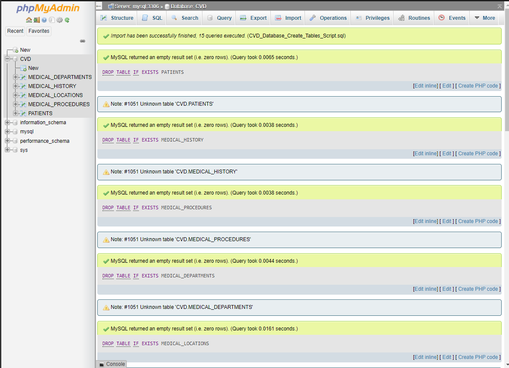

## SQL Scripts

SQL scripts are a series of commands or a program that will be executed on an SQL server.

SQL scripts are useful for making complex database changes and can be used to create, modify, or delete database objects such as tables, views, stored procedures, and functions.


## Applications of SQL Scripts

Here are some of the things that you can do with SQL scripts:

- **Create tables**<br />
  You can use SQL scripts to create new tables in your database. This is useful when you need to add new functionality to your application or when you want to store new types of data.
- **Drop tables**<br />
  SQL scripts often have commands to Drop tables from databases. This is especially important before Create table commands to make sure that a table with the same name doesn’t exist in the database already.
- **Insert data**<br />
  SQL scripts can also be used to insert data into your tables. This is useful when you need to populate your database with test data or when you want to import data from an external source.
- **Update data**<br />
  You can use SQL scripts to update existing data in your tables. This is useful when you need to correct errors or update records based on changing business requirements.
- **Delete data**<br />
  SQL scripts can also be used to delete data from your tables. This is useful when you need to remove old or obsolete records from your database.
- **Create views**<br />
  Views are virtual tables that allow you to query data from multiple tables as if they were a single table. You can use SQL scripts to create views that simplify complex queries and make it easier to work with your data.
- **Create stored procedures**<br />
  Stored procedures are precompiled SQL statements that can be executed on demand. You can use SQL scripts to create stored procedures that encapsulate complex business logic and make it easier to manage your database.
- **Create triggers**<br />
  Triggers are special types of stored procedures that are automatically executed in response to certain events, such as an insert, update, or delete operation. You can use SQL scripts to create triggers that enforce business rules and maintain data integrity.


## Example: Creating Tables

Let us execute a script containing the CREATE TABLE commands for all the tables in a given dataset, rather than create each table manually by typing the DDL commands in the SQL editor.

Note the following points about these scripts.

1. SQL scripts are basically a set of SQL commands compiled in a single file.
2. Each command must be terminated with a delimiter or terminator. Most often, the default delimiter is a semicolon `;`.
3. It is advisable to keep the extension of the file as `.sql`.
4. Upon importing this file in the phpMyAdmin interface, the commands in the file are run sequentially.


Consider the following script:

```sql
DROP TABLE IF EXISTS PATIENTS;
DROP TABLE IF EXISTS MEDICAL_HISTORY;
DROP TABLE IF EXISTS MEDICAL_PROCEDURES;
DROP TABLE IF EXISTS MEDICAL_DEPARTMENTS;
DROP TABLE IF EXISTS MEDICAL_LOCATIONS;

CREATE TABLE PATIENTS (
  PATIENT_ID CHAR(9) NOT NULL,
  FIRST_NAME VARCHAR(15) NOT NULL,
  LAST_NAME VARCHAR(15) NOT NULL,
  SSN CHAR(9),
  BIRTH_DATE DATE,
  SEX CHAR,
  ADDRESS VARCHAR(30),
  DEPT_ID CHAR(9) NOT NULL,
  PRIMARY KEY (PATIENT_ID)
);

CREATE TABLE MEDICAL_HISTORY (
  MEDICAL_HISTORY_ID CHAR(9) NOT NULL,
  PATIENT_ID CHAR(9) NOT NULL,
  DIAGNOSIS_DATE DATE,
  DIAGNOSIS_CODE VARCHAR(10),
  MEDICAL_CONDITION VARCHAR(100),
  DEPT_ID CHAR(9),
  PRIMARY KEY (MEDICAL_HISTORY_ID)
);

CREATE TABLE MEDICAL_PROCEDURES (
  PROCEDURE_ID CHAR(9) NOT NULL,
  PROCEDURE_NAME VARCHAR(30),
  PROCEDURE_DATE DATE,
  PATIENT_ID CHAR(9) NOT NULL,
  DEPT_ID CHAR(9),
  PRIMARY KEY (PROCEDURE_ID)
);

CREATE TABLE MEDICAL_DEPARTMENTS (
  DEPT_ID CHAR(9) NOT NULL,
  DEPT_NAME VARCHAR(15),
  MANAGER_ID CHAR(9),
  LOCATION_ID CHAR(9),
  PRIMARY KEY (DEPT_ID)
);

CREATE TABLE MEDICAL_LOCATIONS (
  LOCATION_ID CHAR(9) NOT NULL,
  DEPT_ID CHAR(9) NOT NULL,
  LOCATION_NAME VARCHAR(50),
  PRIMARY KEY (LOCATION_ID, DEPT_ID)
);
```

This script incorporates commands to first drop any tables with the mentioned names in the database. After that, the script contains commands to create 5 different tables. All these commands are executed sequentially on the interface.

The contents of this file can be saved in a `.sql` file format and executed on the `phpMyAdmin` interface. This can be done by first selecting the database, uploading the SQL script in the provided space, and executing it, as shown in the image below.


Upon successful execution of each statement in sequence, an note appears on the interface as shown in the image below. It is also prudent to note that the tables created are now visible in the tree structure on the left under the selected database.



You may click any of the tables to see its Table Definition (its list of columns, data types, and so on). The image below displays the structure of the table PATIENTS.

