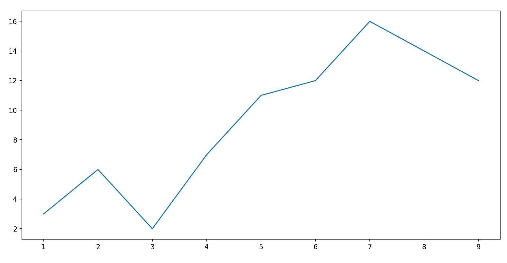
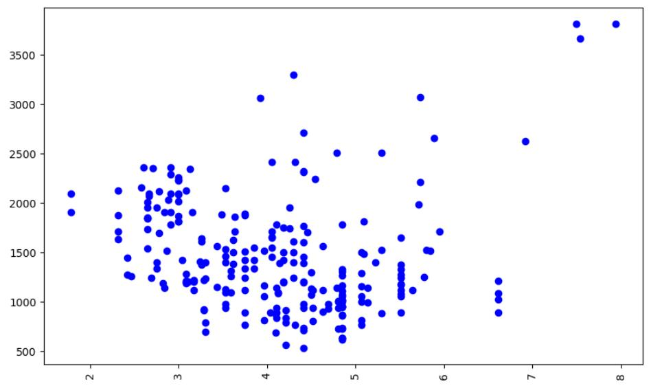
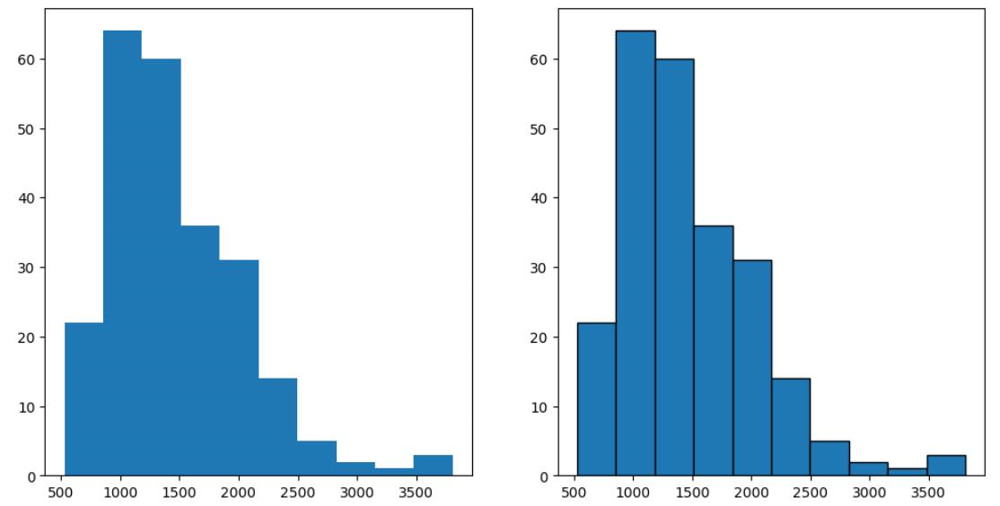
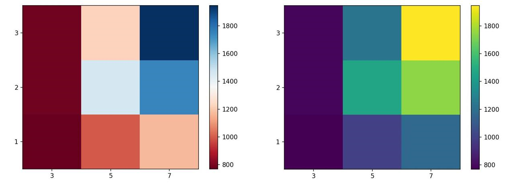
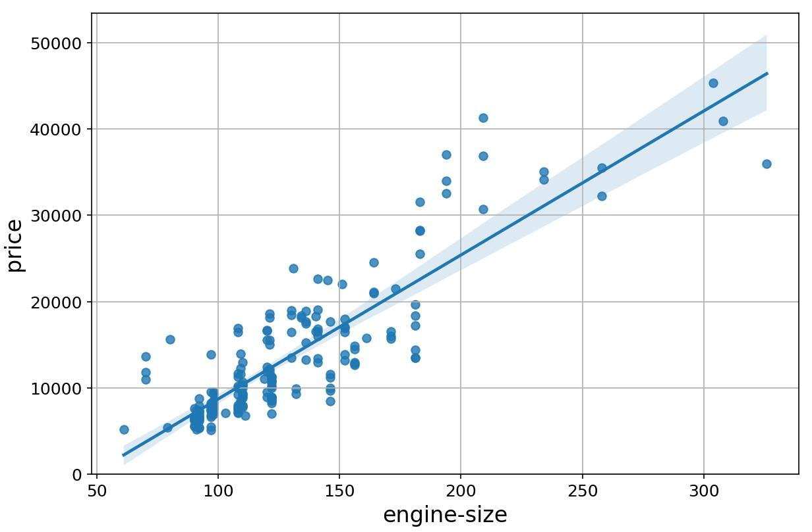
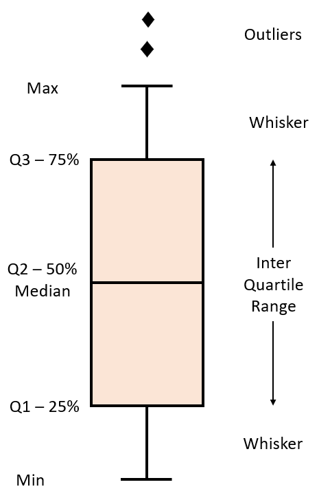
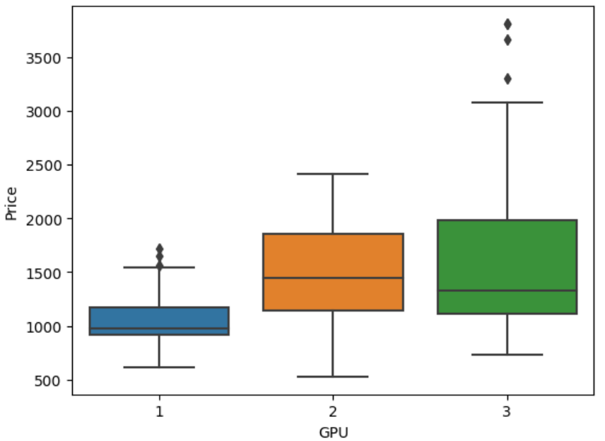
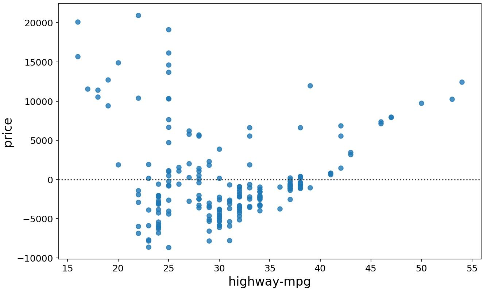
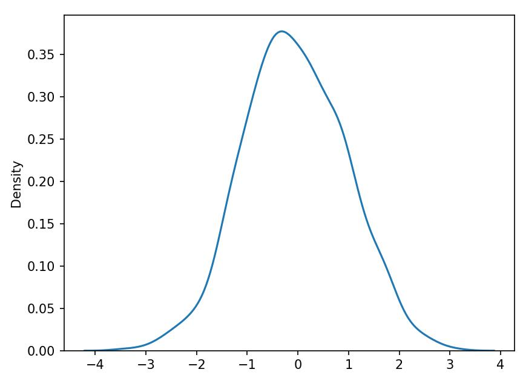
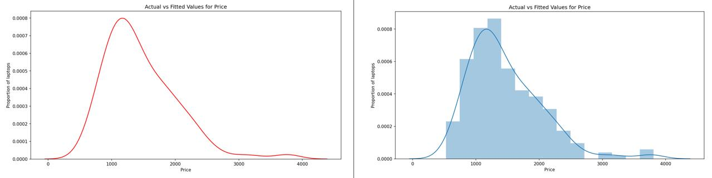

## Importing libraries

You can import the above-mentioned libraries as shown below.

**a. matplotlib**

```python
from matplotlib import pyplot as plt
```

Alternatively, the command can also be written as:

```python
import matplotlib.pyplot as plt
```

Note that most of the plots that are of interest to us in this library are contained in the `pyplot` subfolder of the package.

`matplotlib` functions return a plot object which requires additional statements to display. While using `matplotlib` in `Jupyter` Notebooks, we require the graph to be displayed inside the notebook interface itself. It is, therefore, essential to add the following 'magic' statement after loading the library.

```text
%matplotlib inline
```

**b. seaborn**

Seaborn is usually imported in a code using the following statement:

```python
import seaborn as sns
```

## matplotlib functions

**1. Standard Line Plot**

The simplest and most fundamental plot is a standard line plot. The function expects two arrays as input, `x` and `y`, both of the same size. `x` is treated as an independent variable and `y` as the dependent one. The graph is plotted as shortest line segments joining the `x,y` point pairs ordered in terms of the variable `x`.

**Syntax:**

```python
plt.plot(x, y)
```

A sample plot is shown in the image below.



**2. Scatter plot**

Scatter plots are graphs that present the relationship between two variables in a data set. It represents data points on a two-dimensional plane. The independent variable or attribute is plotted on the X-axis, while the dependent variable is plotted on the Y-axis.

Scatter plots are used in either of the following situations:

- When we have paired numerical data
- When there are multiple values of the dependent variable for a unique value of an independent variable
- In determining the relationship between variables in some scenarios

**Syntax:**

```python
plt.scatter(x, y)
```

Here, `x` contains the independent variable, and `y` contains the dependent variable. You have the option to change the size, color, and shape of the markers with additional attributes in the function.
A sample scatter plot is shared below.



**3. Histogram**

A histogram is an important visual representation of data in categorical form. To view the data in a "Binned" form, we may use the histogram plot with a number of bins required or even with the data points that mark the bin edges. The x-axis represents the data bins, and the y-axis represents the number of elements in each of the bins.

**Syntax:**

```
plt.hist(x,bins)
```

An example of a histogram plot is shown below. Use an additional argument, `edgecolor`, for better clarity of plot.
Consider the graph shown below. The left graph is the histogram plot for a data set, plotted without setting the `edgecolor`. The right one is the same graph but has the `edgecolor` argument set as the color `black`.



**4. Bar plot**

A bar plot is used for visualizing categorical data. The y-axis represents the average value of data points belonging to a particular category, while the x-axis represents the number of elements in the different categories.

**Syntax:**

```python
plt.bar(x, height)
```

Here, `x` is the categorical variable, and `height` is the number of values belonging to the category. You can adjust the width of each bin using an additional `width` argument in the function.

A sample graph is shown below.


**5. Pseudo Color Plot**

A pseudo color plot displays matrix data as an array of colored cells (known as faces). This plot is created as a flat surface in the x-y plane. The surface is defined by a grid of x and y coordinates that correspond to the corners (or vertices) of the faces. Matrix C specifies the colors at the vertices. The color of each face depends on the color of one of its four surrounding vertices. Of the four vertices, the one that comes first in the x-y grid determines the color of the face.

In this course, you use the pcolor plot for visualizing the contents of a pivot table that has been grouped on the basis of 2 parameters. Those parameters then represent the x and y-axis components that create the grid. The values in the pivot table are the average values of a third parameter. These values act as the code for the color the cell is going to take.

**Syntax:**

```
plt.pcolor(C)
```

You can define an additional `cmap` argument to specify the color scheme of the plot.

Two sample pcolor plots are shown below, created for same data but for different color schemes.



## seaborn functions

**1. Regression plot**

A regression plot draws a scatter plot of two variables, x and y, and then fits the regression model and plots the resulting regression line along with a 95% confidence interval for that regression. The x and y parameters can be shared as the dataframe headers to be used, and the data frame itself is passed to the function as well.

**Syntax:**

```
sns.regplot(x='header_1', y='header_2', data=df)
```

A sample regression plot is shared below.



**2. Box and whisker plot**

A box plot (or box-and-whisker plot) shows the distribution of quantitative data in a way that facilitates comparisons between variables or across levels of a categorical variable. The box shows the quartiles of the dataset while the whiskers extend to show the rest of the distribution, except for points that are determined to be "outliers".

Consider the Box and whisker plot interpretation figure shown below.



The plot uses whiskers to represent Minimum value to 25% quartile data and 75% quartile to Maximum value data. The range between 25% quartile and 75% quartile is considered as the Inter-Quartile Range. Outliers are generally classified as being outside 1.5 times the interquartile range.

A sample box plot is shown below


**3. Residual Plot**

A residual plot is used to display the quality of polynomial regression. This function will regress y on x as a polynomial regression and then draw a scatterplot of the residuals.
Residuals are the differences between the observed values of the dependent variable and the predicted values obtained from the regression model. In other words, a residual is a measure of how much a regression line vertically misses a data point, meaning how far off the predictions are from the actual data points.

**Syntax:**

```python
sns.residplot(data=df, x="header_1", y="header_2")
```

Alternatively:

```python
sns.residplot(x=df["header_1"], y=df["header_2"])
```

A sample plot is shown below.



**4. KDE plot**

A Kernel Density Estimate (KDE) plot is a graph that creates a probability distribution curve for the data based upon its likelihood of occurrence on a specific value. This is created for a single vector of information. It is used in the course in order to compare the likely curves of the actual data with that of the predicted data.

**Syntax:**

```python
sns.kdeplot(X)
```

A sample graph made for a random set of values is shown below.



**5. Distribution Plot**

This plot has the capacity to combine the histogram and the KDE plots. This plot creates the distribution curve using the bins of the histogram as a reference for estimation. You can optionally keep or discard the histogram from being displayed. In the context of the course, this plot can be used interchangeably with the KDE plot.

**Syntax:**

```python
sns.distplot(X, hist=False)
```

Here, keeping the argument `hist` as `True` would plot the histogram along with the distribution plot. Both variations are shown in the image below.


