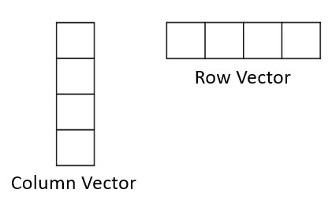
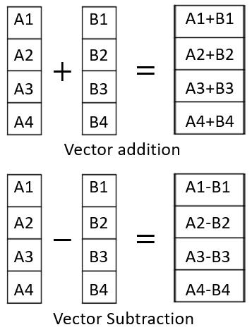
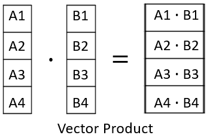
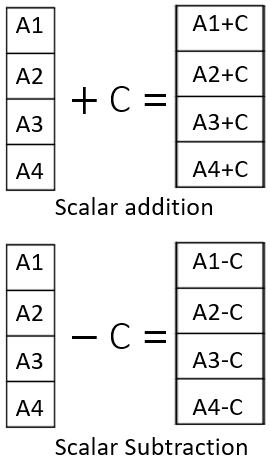
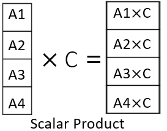
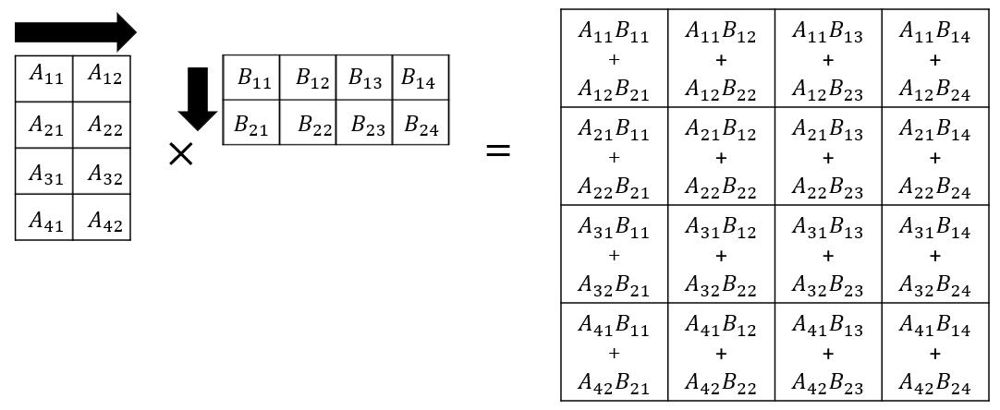

## Matrix Mathematics

You have seen that you can use Numpy package functions to perform different types of operations on arrays and matrices. In this reading, you will learn how these operations work mathematically.

### 1D Arrays : Vectors

A 1D array is often termed as a vector. Depending upon the orientation of the data, the vector can be classified as a row vector or a column vector. This is illustrated in the image below.

Mathematically, we can add, subtract, and take the product of two vectors, provided they are the same shape. The images below highlight the mathematical operations conducted on a pair of vectors.

All three of these operations are conducted on corresponding elements of individual vectors. The resulting array always has the same size as that of the two original vectors.

To a single vector, we can also add a constant (scalar addition), subtract a constant (scalar subtraction) and multiply a constant (scalar multiplication) to any vector. The images below illustrate these operations.

### 2D Arrays : Matrices

A 2D array is also called a Matrix. These are typically rectangular arrays with data stored in different rows. All of the operations mentioned above are also applicable to the 2D arrays. However, the Dot product of 2D matrices follows a different rule.

As illustrated in the images below, the dot product is carried out by multiplying and adding corresponding elements of rows of the first matrix with the elements of columns of the second matrix. As a result, the output matrix from the multiplication will have a modified shape.

The general rule is that the dot product of an `m × n` matrix can be done only with an `n × p` matrix, and the resultant matrix will have the shape `m × p`. In the example shown below, the `4 × 2` matrix is multiplied with the `2 × 4` matrix to generate a `4 × 4` matrix.

In the reverse example, when `2 × 4` matrix is multiplied with the `4 × 2` one, the resultant will be a `2 × 2` matrix.

> Note: Dot product of a row vector with a column vector, with the same number of elements, would return a single scalar value. Dot product of a column vector with a row vector, will return a 2D matrix.