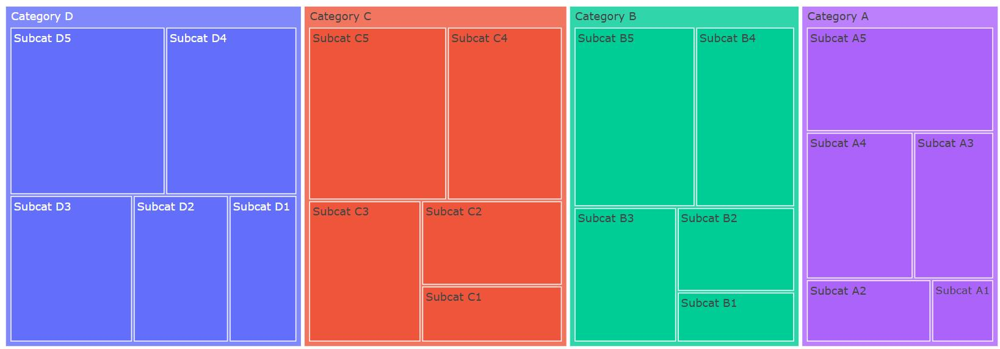
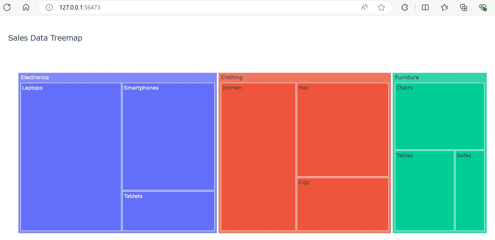
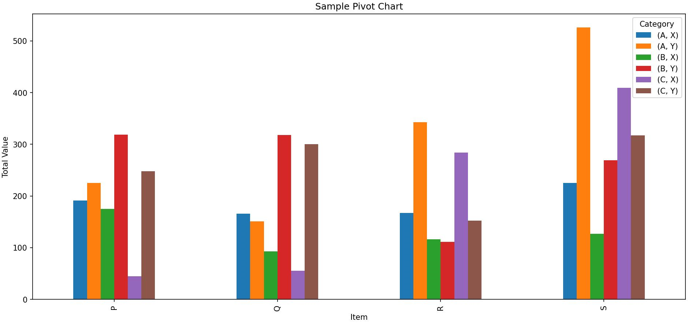
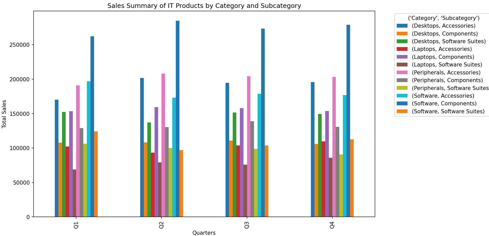

# Understanding Treemaps and Pivot Charts

## Treemaps

Treemaps are a form of data visualization that displays hierarchical data using nested rectangles. Each branch of the hierarchy is given a rectangle, which is then tiled with smaller rectangles representing sub-branches. Treemaps are particularly useful for visualizing large datasets where the hierarchical structure is crucial, offering an intuitive and space-efficient way to display data.



### Applications of Treemaps

Treemaps are employed across various domains due to their ability to effectively communicate complex hierarchical data. Some common applications include:

1. **Business Analytics**: Visualizing the composition of sales by product categories and subcategories.
2. **Finance**: Displaying the performance of stock portfolios, sectors, and industries.
3. **IT and Network Management**: Representing file systems or network usage, showing the distribution of files and folders.
4. **Bioinformatics**: Displaying hierarchical biological data, such as taxonomies or genomic structures.
5. **Website Analytics**: Showing the structure of website traffic, with rectangles representing web pages and their size indicating the volume of visits.

### Importance in Data Visualization

Treemaps are important in data visualization for several reasons:

- **Space Efficiency**: Treemaps make efficient use of space, allowing large datasets to be visualized within a limited area.
- **Hierarchy Representation**: They provide a clear representation of hierarchical data, showing both the structure and the quantitative relationship between elements.
- **Comparative Analysis**: Treemaps make it easy to compare the sizes of different elements at various levels of the hierarchy.
- **Immediate Insight**: The color and size of the rectangles can quickly convey important information, making it easier for users to spot patterns and outliers.

#### Syntax for Generating Treemap

We can generate Treemaps using the Plotly library in Python.

1. **Install Required Libraries**:

   ```bash
   pip install plotly pandas
   ```

2. **Import Libraries**:

   ```python
   import pandas as pd
   import plotly.express as px
   ```

3. **Load Data**:

   ```python
   # Replace with your actual dataset or data source
   data = {
       "Category": ["Category 1", "Category 1", "Category 2", "Category 2", "Category 3"],
       "Subcategory": ["Subcategory 1A", "Subcategory 1B", "Subcategory 2A", "Subcategory 2B", "Subcategory 3A"],
       "Value": [10, 20, 30, 40, 50]
   }
   df = pd.DataFrame(data)
   ```

4. **Create Treemap**:

   ```python
   fig = px.treemap(df,
                    path=["Category", "Subcategory"],  # Define hierarchical structure
                    values="Value",  # Size of each rectangle
                    title="Treemap Example")  # Title of the treemap
   ```

5. **Show Treemap**:

   ```python
   fig.show()
   ```

### Practical Example: Visualizing Sales Data

Let's use Plotly Express to visualize the sales data example.

#### Sample Data

Assume we have the following hierarchical sales data:

- Electronics
  - Laptops: 120,000
  - Smartphones: 80,000
  - Tablets: 30,000
- Furniture
  - Chairs: 50,000
  - Tables: 40,000
  - Sofas: 20,000
- Clothing
  - Men: 70,000
  - Women: 90,000
  - Kids: 40,000

#### Code to Generate Treemap

```python
import plotly.express as px
import pandas as pd
# Sales data
data = {
    "Category": ["Electronics", "Electronics", "Electronics", 
                 "Furniture", "Furniture", "Furniture", 
                 "Clothing", "Clothing", "Clothing"],
    "Subcategory": ["Laptops", "Smartphones", "Tablets", 
                    "Chairs", "Tables", "Sofas", 
                    "Men", "Women", "Kids"],
    "Sales": [120000, 80000, 30000, 
              50000, 40000, 20000, 
              70000, 90000, 40000]
}
df = pd.DataFrame(data)
# Creating the treemap
fig = px.treemap(
    df,
    path=["Category", 'Subcategory'],
    values="Sales",
    title="Sales Data Treemap"
)
fig.show()
```

#### Output



### Conclusion

Treemaps are a powerful tool for visualizing hierarchical data, offering an efficient and intuitive way to compare elements within a hierarchy. Their applications are diverse, ranging from business analytics to bioinformatics. By following the provided code, you can generate treemaps to visualize your own hierarchical datasets, making it easier to gain insights and communicate information effectively.

## Pivot Charts

### Introduction

Pivot charts are a powerful tool used for data visualization and analysis. They allow users to dynamically summarize and explore large datasets, revealing insights and trends that might not be immediately obvious. Pivot charts are widely used in business intelligence, finance, marketing, and various other fields where data analysis is crucial.

#### Applications of Pivot Charts

1. **Business Intelligence**: Pivot charts help in summarizing complex business data, making it easier for stakeholders to make informed decisions.
2. **Finance**: Analysts use pivot charts to visualize financial data, track performance metrics, and forecast trends.
3. **Marketing**: Marketers leverage pivot charts to analyze campaign performance, customer demographics, and sales trends.
4. **Operations**: Operational managers use pivot charts to monitor supply chain performance, inventory levels, and process efficiencies.
5. **Healthcare**: Pivot charts assist in visualizing patient data, treatment outcomes, and operational efficiency in healthcare settings.

#### Importance in Data Visualization

- **Data Summarization**: Quickly summarizes large datasets, making them more manageable and understandable.
- **Dynamic Analysis**: Allows users to interactively explore data by filtering, sorting, and drilling down into specific areas of interest.
- **Trend Identification**: Helps in identifying patterns and trends that can inform strategic decision-making.
- **Efficiency**: Enhances productivity by providing a quick way to visualize and interpret data without extensive manual processing.
- **Presentation**: Facilitates the creation of professional and informative reports that can be easily shared with stakeholders.

#### Sample

Consider a sample data given below. This data is assumed to have a 100 entries.

| Item | Category | Subcategory | Value |
|------|----------|-------------|-------|
| P    | B        | Y           | 62    |
| S    | C        | Y           | 86    |
| Q    | A        | X           | 98    |
| P    | A        | Y           | 45    |
| S    | C        | X           | 35    |
| ...  | ...      | ...         | ...   |
| P    | B        | X           | 37    |
| R    | B        | Y           | 26    |
| S    | A        | Y           | 33    |
| Q    | A        | Y           | 43    |
| P    | A        | Y           | 15    |

Treating the column `Item` as the index, i.e., the row component, and `Category` and `Subcategory` as columns, i.e., the column components, with `Value` acting as the aggregated entity, the pivot graph can be created, summarizing the data as shown below.



#### Syntax for Generating Pivot Charts in Python

Python, with libraries such as Pandas and Matplotlib, provides robust capabilities for creating pivot charts. Below is a step-by-step guide to generating pivot charts using Python.

1. **Install Required Libraries**:

   ```bash
   pip install pandas matplotlib
   ```

2. **Import Libraries**:

   ```python
   import pandas as pd
   import matplotlib.pyplot as plt
   ```

3. **Load Data**:

   ```python
   # Load data into a pandas DataFrame
   data = pd.read_csv("your_dataset.csv")
   ```

4. **Create a Pivot Table**:

   ```python
   pivot_table = data.pivot_table(values="ValueColumn", index="RowIndexColumn", columns="ColumnIndexColumn", aggfunc="sum")
   ```

5. **Generate Pivot Chart**:

   ```python
   pivot_table.plot(kind="bar")
   plt.title("Pivot Chart Title")
   plt.xlabel("X-axis Label")
   plt.ylabel("Y-axis Label")
   plt.show()
   ```

#### Practical Example

Let's walk through a practical example using a sample dataset. We'll create a pivot chart to visualize sales data.

1. **Sample Data**:
   For this example, we are creating dummy data on sales of IT products across different quarters. The data generated would be of the following form.

   | S. No. | Date | Category    | Subcategory     | Sales |
   |--------|------|-------------|-----------------|-------|
   | 0      | Q1   | Peripherals | Accessories     | 2092  |
   | 1      | Q1   | Software    | Accessories     | 4695  |
   | 2      | Q1   | Software    | Components      | 3106  |
   | 3      | Q1   | Desktops    | Accessories     | 3527  |
   | 4      | Q1   | Laptops     | Software Suites | 1182  |
   | …      | …    | …           | …               | …     |
   | 2395   | Q4   | Desktops    | Accessories     | 2557  |
   | 2396   | Q4   | Software    | Accessories     | 2626  |
   | 2397   | Q4   | Desktops    | Components      | 2427  |
   | 2398   | Q4   | Software    | Components      | 1768  |
   | 2399   | Q4   | Peripherals | Components      | 1714  |

   ```python
   import pandas as pd
   import numpy as np
   import matplotlib.pyplot as plt
   
   # Define the parameters
   num_quarters = 4
   num_categories = 4
   num_subcategories = 3
   num_samples = num_quarters * num_categories * num_subcategories * 50
   
   # Generate sample sales data
   np.random.seed(40)
   
   # Creating sample data
   dates = np.repeat(["Q1", "Q2", "Q3", "Q4"], 50 * num_categories * num_subcategories)
   categories = np.tile(np.random.choice(["Laptops", "Desktops", "Peripherals", "Software"], size=num_quarters * 50), num_categories * num_subcategories)
   subcategories = np.tile(np.random.choice(["Accessories", "Components", "Software Suites"], size=num_quarters * 50), num_categories * num_subcategories)
   sales_values = np.random.randint(1000, 5000, size=num_samples)
   
   # Create DataFrame
   df = pd.DataFrame({
       "Date": dates,
       "Category": categories,
       "Subcategory": subcategories,
       "Sales": sales_values
   })
   ```

   

2. **Create a Pivot Table**:

   ```python
   # Create pivot table
   pivot_table = df.pivot_table(index="Date", columns=["Category", "Subcategory"], values="Sales", aggfunc=np.sum)
   ```

3. **Generate Pivot Chart**:

   ```python
   # Plotting a pivot chart
   pivot_table.plot(kind="bar", figsize=(14, 8))
   plt.title("Sales Summary of IT Products by Category and Subcategory")
   plt.xlabel("Quarters")
   plt.ylabel("Total Sales")
   plt.grid(False)
   plt.legend(title=("Category", "Subcategory"), bbox_to_anchor=(1.05, 1), loc="upper left")
   plt.tight_layout()
   plt.show()
   ```

#### Output



#### Conclusion

Pivot charts are an indispensable tool for data analysis, providing a dynamic and intuitive way to summarize and visualize data. By leveraging libraries like Pandas and Matplotlib in Python, you can easily create pivot charts to uncover insights and make data-driven decisions. Whether for business intelligence, finance, marketing, or any other field, pivot charts enhance the ability to analyze and interpret data effectively.